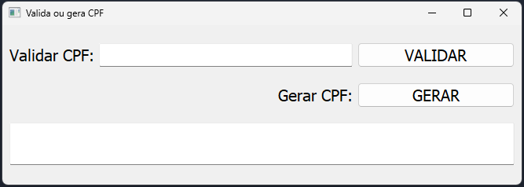

<h1>Gerador e validador de CPF</h1>

<br>

<p>Projeto desenvolvido em python</p>

<br>

<hr>

<h2 align='center'>Imagem do Projeto</h2>



>projeto finalizado

<hr>

<br>

<h2>
Para utilizar a aplicação basta instalar o módulo pyqt5 com o seguinte comando em seu terminal:
</h2>

```
pip install pyqt5
```

<p>Obs.: Recomendo que crie um ambiente virtual em sua máquina.</p>
